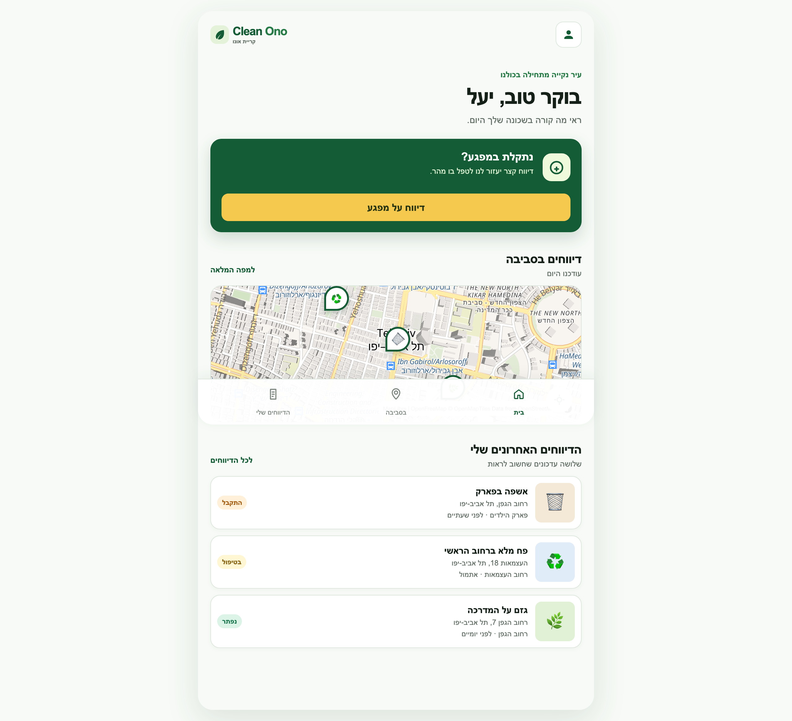
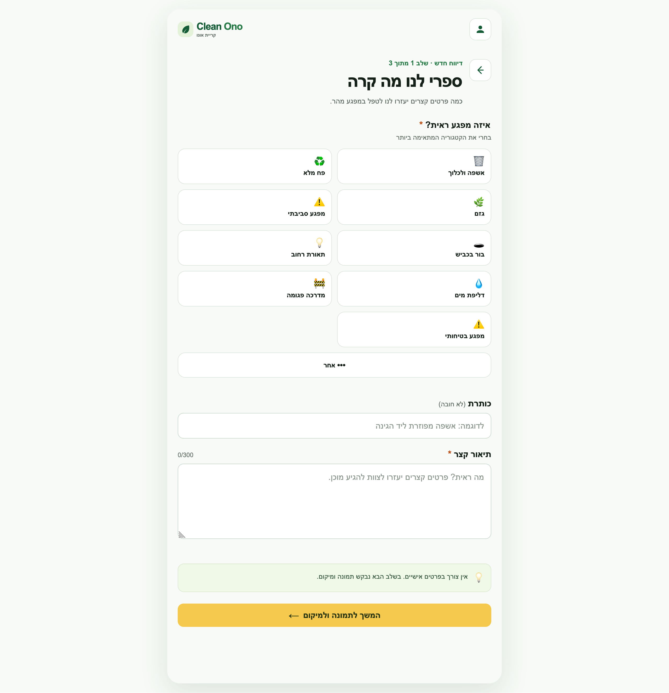
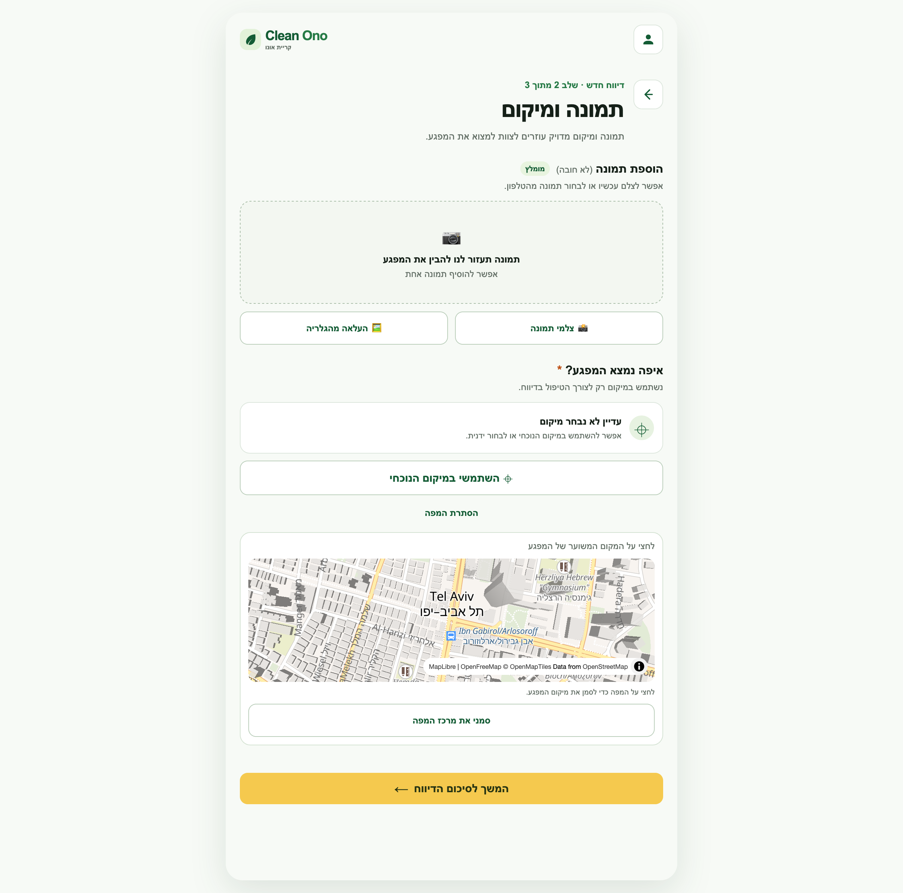
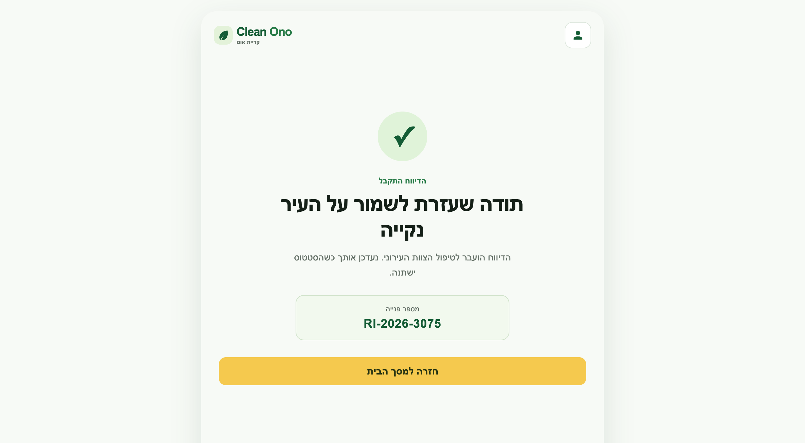
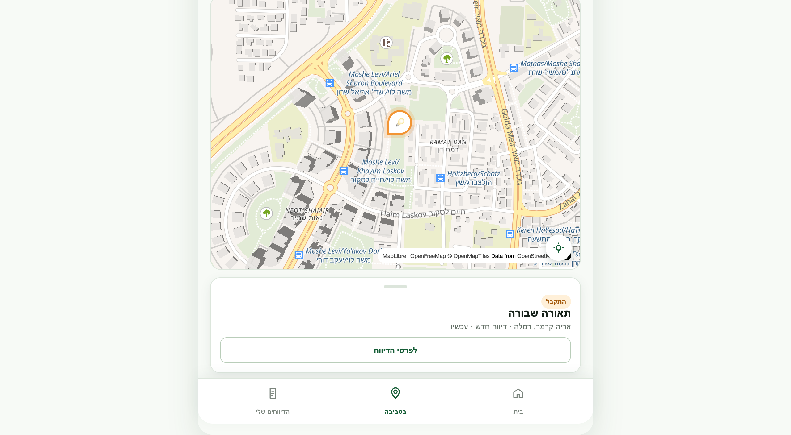

# Report It — Municipal Issue Reporting

A responsive web application for reporting municipal issues, tracking their progress, and viewing nearby reports on an interactive map.

The application was designed for **Clean Ono — Kiryat Ono Municipality**. It provides a complete right-to-left Hebrew interface and a clear, mobile-friendly reporting flow.

## Live Demo

### [Open Report It](https://yafitavazov.github.io/report-it/)

## Features

- Create a new report through a guided three-step process.
- Select an issue category and add a title, description, and photo.
- Use the current location or select a point manually on the map.
- Explore nearby reports and filter them by category and status.
- Track personal reports and their handling status.
- View report details, location, and progress timeline.
- Use a responsive and accessible right-to-left interface.

## Main Screens

### Home Dashboard

The home screen provides a quick overview of nearby reports, an interactive map, and the user's latest submissions.

<p align="center">
  
</p>

### Create a Report

Users can select an issue category, enter a short description, add a photo, and choose an accurate location.

<p align="center">
  
  
</p>

### Report Confirmation and Nearby Map

After submission, the user receives a reference number. The nearby map allows users to select reports and open their details.

<p align="center">
  
  
</p>

## Technologies

- HTML5, CSS3, and vanilla JavaScript.
- [MapLibre GL JS](https://maplibre.org/) for interactive maps.
- OpenFreeMap and OpenStreetMap map data.
- Nominatim for reverse geocoding.
- Geolocation API for the user's current location.
- Local Storage for saving user details and reports in the browser.

## Project Structure

```text
report-it/
├── index.html          # Application screens and markup
├── styles.css          # Responsive and RTL styling
├── app.js              # Application logic, reports, and maps
└── docs/screenshots/   # Project screenshots used in this README
```
