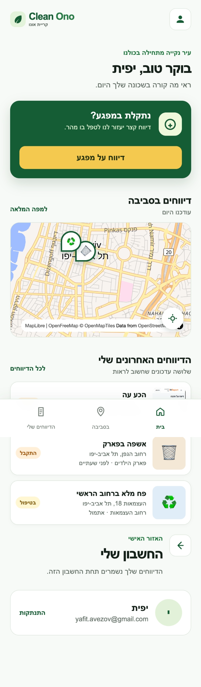

# Report It — דיווחים לעיר נקייה

אפליקציית ווב רספונסיבית לדיווח על מפגעים עירוניים, מעקב אחר הטיפול בהם וצפייה בדיווחים על גבי מפה.

האפליקציה עוצבה עבור **Clean Ono — עיריית קריית אונו**, עם ממשק מלא בעברית ותהליך דיווח קצר וברור שמתאים למחשב ולמובייל.

### [לצפייה באפליקציה החיה](https://yafitavazov.github.io/report-it/)

<p align="center">
  
</p>

## מה אפשר לעשות באפליקציה?

- לפתוח דיווח חדש בתהליך מודרך של שלושה שלבים.
- לבחור סוג מפגע, להוסיף תיאור ותמונה ולסמן מיקום.
- להשתמש במיקום הנוכחי או לבחור נקודה ידנית על המפה.
- לצפות בדיווחים מהאזור ולסנן אותם לפי קטגוריה וסטטוס.
- לעקוב אחר דיווחים אישיים וסטטוס הטיפול בהם.
- לצפות בפרטי הדיווח, במיקום ובציר הזמן של הטיפול.
- להשתמש בממשק רספונסיבי ונגיש בעברית מלאה (RTL).

## מסכים מרכזיים

### מסך הבית

סקירה מהירה של דיווחים בסביבה, מפה אינטראקטיבית והדיווחים האחרונים של המשתמשת.

<p align="center">
  
</p>

### יצירת דיווח

בחירת סוג המפגע והוספת פרטים קצרים, ולאחר מכן הוספת תמונה ובחירת מיקום מדויק.

<p align="center">
  
  
</p>

### אישור דיווח ומפת הסביבה

בסיום מתקבל מספר פנייה. במפת הסביבה אפשר לבחור דיווח ולפתוח את פרטיו.

<p align="center">
  
  
</p>

## טכנולוגיות

- HTML5, CSS3 ו־JavaScript ללא תלויות build.
- [MapLibre GL JS](https://maplibre.org/) להצגת מפות אינטראקטיביות.
- מפות מבוססות OpenFreeMap ו־OpenStreetMap.
- Nominatim להמרת מיקום לכתובת.
- Geolocation API לקבלת מיקום המשתמשת.
- Local Storage לשמירת משתמשת ודיווחים בדפדפן.

## הרצה מקומית

אין צורך בהתקנת חבילות. לאחר שכפול המאגר, הפעילו שרת מקומי מתוך תיקיית הפרויקט:

```bash
python3 -m http.server 8000
```

לאחר מכן פתחו בדפדפן: [http://localhost:8000](http://localhost:8000)

> המפות, איתור הכתובת והמיקום דורשים חיבור לאינטרנט והרשאת מיקום בדפדפן.

## מבנה הפרויקט

```text
report-it/
├── index.html          # מבנה המסכים
├── styles.css          # עיצוב רספונסיבי ו־RTL
├── app.js              # לוגיקה, דיווחים ומפות
└── docs/screenshots/   # תמונות לתיעוד הפרויקט
```
